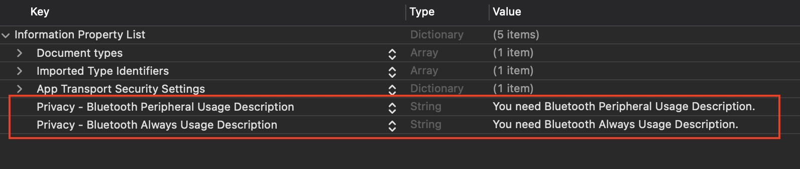

# SatelliteBox-Swift

A description of this package.

## Features
- Scan for devices.
- Connect to device.
- Write value to device.
- Disconnect device.

## Usage

You need to import library on your head class.

```swift

import SatelliteBox-Swift

```

Scanning for devices in this function.

```swift

BT_Manager().setupScan_BT(completion: ([M_UserBluetooth]) -> Void)

```

Usage Example #1

```swift

var myBluetoothList      = [M_UserBluetooth]() //Get data from search.

BT_Manager().setupScan_BT { [self] (results) in
    
    if results.count != 0 {
        
        myBluetoothList    = results

    } else {

        print("Device not found.")
    }
}

```

You can connect devices in this function.

```swift

BT_Manager().setupConnect_BT(peripheral: Peripheral, ipDevice: String, rssi: Int, completion: ([M_UserBluetooth]) -> Void)

```

Usage Example #2

```swift

BT_Manager().setupConnectBT(peripheral: peripheral, ipDevice: ipDevice, rssi: rssi) { [self] result in
    
    if result.userConnected == true {
        
            print("Connection success.")

    } else {
        
            print("Connection failed.")
    }
}

```

You can Write Value to devices in this function.

```swift
BT_Manager().setupWriteValue_BT(peripheral: Peripheral, link: String, completion: (Bool) -> Void)
```

Usage Example #3

```swift
BT_Manager().setupWriteValue_BT(peripheral: SharedDefaultsData.sharedInstance.sharedPeripheral, link: index.userChannelURL) { (status) in
    
    if status == true {

        print("succeeded in writing the value")

    } else {
        print("Failed to write value.)
    }
}
```

You can Didconnect to devices in this function.

```swift
BT_Manager().setupDidConnect_BT(peripheral: Peripheral, completion: (Bool) -> Void)
```

Usage Example #4
```swift
BT_Manager().setupDidConnectBT(peripheral: myBluetoothSelecte.peripheral) { [self] status in
    
    if status == true {

            print("Success to disconnect.")
    } else {

            print("Unable to disconnect.")
    }
}
```

## Swift Package Manager

Simply add the package dependency to your Package.swift and depend on "SatelliteBox-Swift" in the necessary targets:
```swift
dependencies: [
    .package(url: "https://github.com/WatcharaphongPSI/SatelliteBox-Swift.git")
]
```

> Don't forget the Privacy Description in `info.plist`.


## Requirements
SatelliteBox-Swift requires iOS 13.0+
